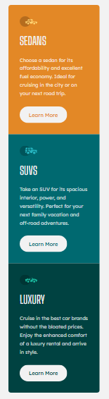

# 3-Column Preview Card Component

Este projeto é uma solução para o desafio [3-column preview card component](https://www.frontendmentor.io/challenges/3column-preview-card-component-pH92eAR2-) do **Frontend Mentor**. O objetivo foi criar um componente de cartão responsivo com três colunas, utilizando HTML e CSS.

## 🚀 Visão Geral

O projeto consiste em um componente de cartão com três seções: **Sedans**, **SUVs** e **Luxury**. Cada seção contém um ícone, um título, uma descrição e um botão "Learn More". O layout é responsivo, adaptando-se a diferentes tamanhos de tela.

### 🖥️ Demonstração

Confira o projeto em funcionamento: [Link para o projeto](https://cadanieldev.github.io/3-column-preview-card/)

### 📸 Screenshots

**Desktop:**

**Mobile:**

## 🛠️ Tecnologias Utilizadas

- **HTML5**: Estrutura semântica do componente.
- **CSS3**: Estilização e responsividade.
- **Grid Layout**: Para organizar as colunas no desktop.
- **Flexbox**: Para alinhar os elementos internos.
- **Media Queries**: Para adaptar o layout a dispositivos móveis.
- **Variáveis CSS**: Para facilitar a manutenção das cores.

## 📂 Estrutura do Projeto
